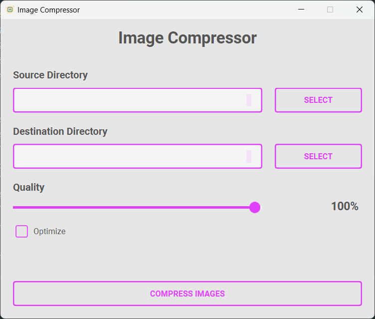

# Image Compressor
### Python script to compress images with both console & GUI modes

## How to set up
1. Clone this repository `https://github.com/iAliF/ImageCompressor`
2. Create a virtual environment `virtualenv venv`
3. Activate the virtual environment
4. Install requirements using `pip install -r requirements.txt`


## Usage
### Console script
```
python main.py -s source -d destination
```
#### Options
```
-s SOURCE, --source SOURCE
                    Source directory
-d DESTINATION, --destination DESTINATION
                    Destination directory
-o OPTIMIZE, --optimize OPTIMIZE
                    Optimize images
-q QUALITY, --quality QUALITY
                     Images quality
-w WORKERS, --workers WORKERS
                      Max workers count
```

### GUI App
**Just run app using** `python app.py`


## Screenshot
